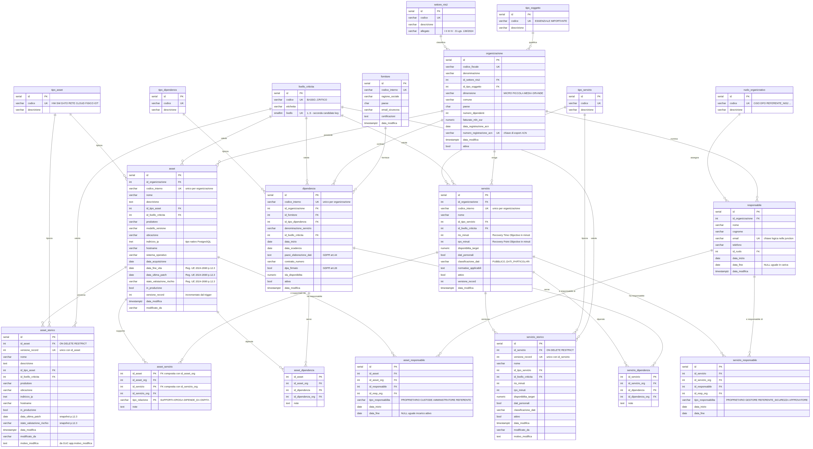

# Registro NIS2/ACN — Base Dati Relazionale per i Profili ACN

**Project Work — Informatica per le Aziende Digitali (L-31)**
Tema n. 2: Privacy e Sicurezza Aziendale — Traccia PW 19

## Descrizione

Registro centralizzato in PostgreSQL per la gestione dei profili informativi
richiesti dall'ACN nell'ambito della Direttiva NIS2 (D.Lgs. 138/2024).

Lo schema implementa direttamente il **Regolamento di esecuzione (UE) 2024/2690**,
punto 12.3 (campi minimi dell'inventario degli asset) e punto 12.4 (proprietario
dell'attivo), e produce le quattro sezioni del profilo ACN in formato CSV
conforme **RFC 4180**.

## Prerequisiti

| Componente | Versione | Note |
|---|---|---|
| PostgreSQL | 15+ | sviluppato su 18, verificato anche su 16 |
| psql o pgAdmin 4 | qualsiasi | nessuna estensione richiesta |

## Installazione

```bash
# 1. Crea il database
createdb -U postgres nis2_acn

# 2. Esegui gli script NELL'ORDINE
psql -U postgres -d nis2_acn -f 01_schema.sql            # 20 tabelle, indici, trigger immutabilita
psql -U postgres -d nis2_acn -f 02_trigger_versioning.sql # versioning, stored procedure
psql -U postgres -d nis2_acn -f 03_dati_test.sql          # dataset simulato (2 org NIS2)
psql -U postgres -d nis2_acn -f 04_query_acn.sql          # query, 4 view CSV, export
psql -U postgres -d nis2_acn -f 05_deploy_test.sql        # ruoli + 17 test automatici

# 3. Imposta le password FUORI dal repository
#    I ruoli sono creati con PASSWORD NULL: il login e impossibile finche
#    non viene assegnata una password in questo passaggio manuale.
psql -U postgres -d nis2_acn -c "ALTER ROLE nis2_app      PASSWORD '<password_sicura>';"
psql -U postgres -d nis2_acn -c "ALTER ROLE nis2_readonly PASSWORD '<password_readonly>';"
```

La sequenza e **idempotente**: `01_schema.sql` inizia con `DROP ... IF EXISTS CASCADE`,
quindi i cinque script possono essere rieseguiti su un database esistente senza errori.

Tutti i 17 test devono stampare `PASS`. In caso contrario lo script si interrompe
con il messaggio di `FAIL` corrispondente.

## Export del profilo ACN

```sql
-- Anteprima completa: 4 sezioni CSV in un unico TEXT
SELECT fn_esporta_profilo_acn('ACN-2024-00123');
```

```bash
# Export su file (da psql CLI) — COPY applica nativamente l'escaping RFC 4180
\COPY (SELECT * FROM vw_profilo_acn_asset      WHERE "ID_ACN" = 'ACN-2024-00123') TO 'asset.csv'      WITH (FORMAT csv, HEADER, QUOTE '"', FORCE_QUOTE *);
\COPY (SELECT * FROM vw_profilo_acn_servizi    WHERE "ID_ACN" = 'ACN-2024-00123') TO 'servizi.csv'    WITH (FORMAT csv, HEADER, QUOTE '"', FORCE_QUOTE *);
\COPY (SELECT * FROM vw_profilo_acn_dipendenze WHERE "ID_ACN" = 'ACN-2024-00123') TO 'dipendenze.csv' WITH (FORMAT csv, HEADER, QUOTE '"', FORCE_QUOTE *);
\COPY (SELECT * FROM vw_profilo_acn_contatti   WHERE "ID_ACN" = 'ACN-2024-00123') TO 'contatti.csv'   WITH (FORMAT csv, HEADER, QUOTE '"', FORCE_QUOTE *);
```

> I file CSV esportati contengono dati personali dei responsabili (nome, email,
> telefono) e sono esclusi dal repository tramite `.gitignore`.

## Struttura del repository

| File | Contenuto |
|---|---|
| `01_schema.sql` | 20 tabelle, FK composite multi-tenant, indici parziali, trigger di immutabilita dello storico |
| `02_trigger_versioning.sql` | Trigger BEFORE UPDATE (snapshot-on-write), `sp_cessa_asset`, `sp_subentra_responsabile`, `fn_storia_asset` |
| `03_dati_test.sql` | Dataset simulato: 2 organizzazioni, 18 asset, 7 servizi, 8 fornitori, 8 dipendenze |
| `04_query_acn.sql` | 6 query analitiche, 4 view CSV, `fn_csv_quote`, `fn_esporta_profilo_acn` |
| `05_deploy_test.sql` | Ruoli e privilegi, 17 test automatici `DO $$ ASSERT $$`, riepilogo |
| `DOCUMENTAZIONE.md` | Data dictionary, normalizzazione, scelte progettuali, threat model |
| `ERD_nis2_ACN.mmd` | Diagramma ER in Mermaid (sorgente versionabile, render su mermaid.live) |
| `README.md` | Questo file |
| `LICENSE` | MIT |
| `.gitignore` | Esclude credenziali, export CSV con dati personali, dump |

## Dataset simulato

| Entita | N. | Dettaglio |
|---|---|---|
| Organizzazioni | 2 | Zagara Neuro Therapeutics (sanitario) · Sole di Sicilia (energia) — entrambe grandi imprese in Allegato I, quindi **essenziali** |
| Asset in produzione | 18 | HW 5 · SW 4 · DATO 3 · RETE 2 · FISICO 2 · CLOUD 1 · IOT 1 |
| Distribuzione criticita | 18 | CRITICO 11 · ALTO 4 · MEDIO 1 · MEDIO-BASSO 1 · BASSO 1 |
| Servizi attivi | 7 | RTO/RPO in minuti; SCADA con RPO = 0 min |
| Fornitori / Dipendenze | 8 / 8 | supply chain con DPA e paesi di elaborazione |
| Responsabili in carica | 7 | CISO, DPO, RESP_ICT, REFERENTE_NIS2 |

**Anomalie deliberate** — servono a dimostrare la capacita di rilevamento del
registro (Query 6), non sono errori del dataset:

- 2 asset privi di PROPRIETARIO → violazione Reg. (UE) 2024/2690 punto 12.4
- 1 dipendenza ad alta criticita priva di DPA → violazione GDPR art. 28
- 2 asset ad alta criticita con `stato_valutazione_rischio = NON_VALUTATO`

## Diagramma ER



Il sorgente versionato e `ERD_nis2_ACN.mmd` (Mermaid `erDiagram`, 20 entita):
e il riferimento autoritativo, perche e diffabile e resta allineato allo schema.
`ERD_nis2_ACN.png` e il render, versionato per comodita di consultazione.

Per rigenerare l'immagine dopo una modifica dello schema: incollare il contenuto
del `.mmd` su <https://mermaid.live> ed esportare in PNG, oppure

```bash
npx -y @mermaid-js/mermaid-cli -i ERD_nis2_ACN.mmd -o ERD_nis2_ACN.png -b white -w 3000
```

## Riferimenti normativi

- Direttiva (UE) 2022/2555 (NIS2) — GUUE L 333 del 27.12.2022
- D.Lgs. 4 settembre 2024, n. 138 — GU Serie Generale n. 230 dell'1.10.2024, artt. 3, 6, 23–25
- Regolamento di esecuzione (UE) 2024/2690 del 17 ottobre 2024 — punti 12.3, 12.4, 14
- ACN, Determinazione n. 164179 del 14 aprile 2025, agg. Determinazioni n. 379887 e n. 379907 del 2025
- Regolamento (UE) 2016/679 (GDPR) — artt. 9, 28, 44

## Sicurezza

- Nessuna password e presente nel codice: i ruoli nascono con `PASSWORD NULL`.
- Si raccomanda `pg_hba.conf` con `scram-sha-256` e connessioni `hostssl`.
- Le tabelle di storico sono append-only su tre livelli (REVOKE, trigger,
  `ON DELETE RESTRICT`). Limite noto: un superuser puo rimuovere i trigger —
  per tamper-evidence completa servono hash-chaining o WAL shipping.

## Disclaimer

I dati contenuti in `03_dati_test.sql` sono **completamente fittizi** e generati
a scopo didattico: denominazioni, codici fiscali, contatti, numeri di contratto e
fornitori sono inventati e non si riferiscono a organizzazioni reali.

## Licenza

MIT — vedi [LICENSE](LICENSE).
